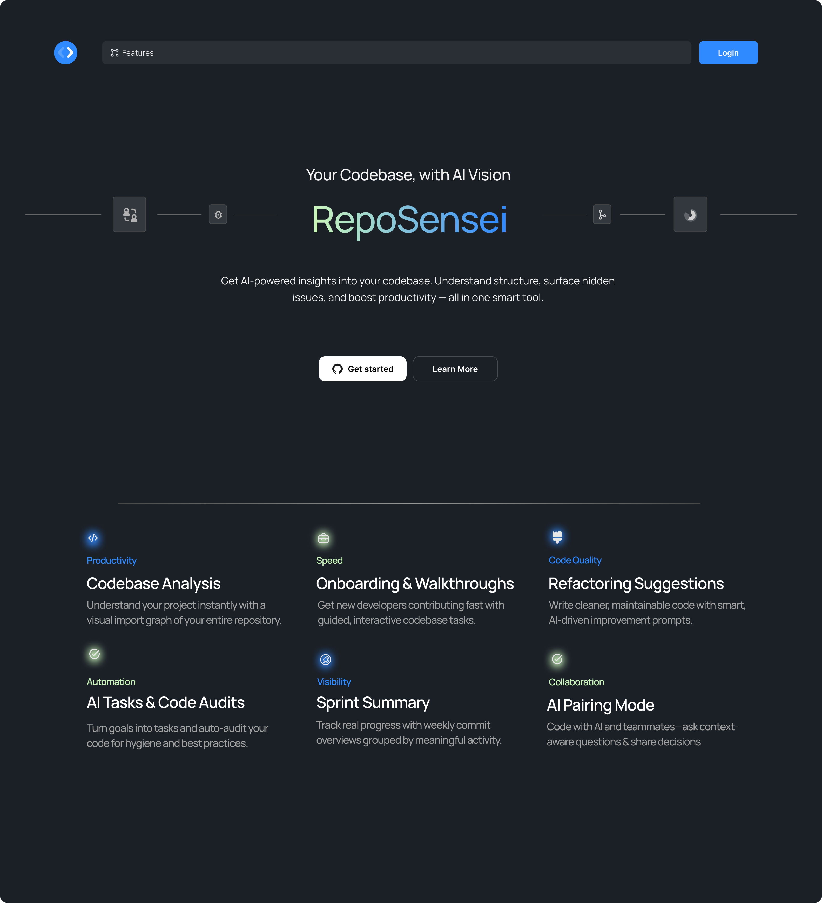
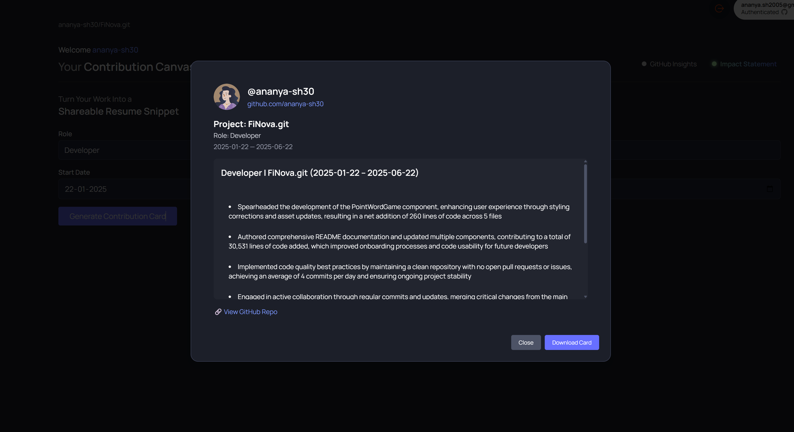
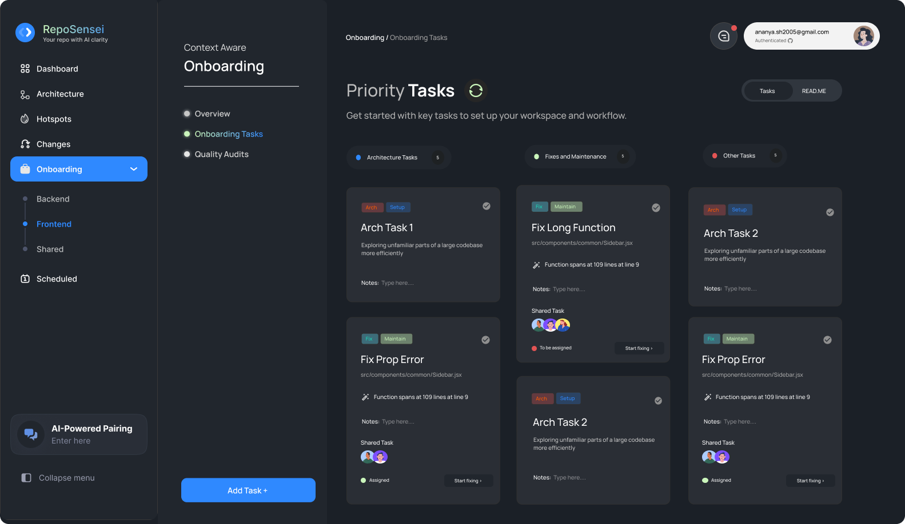
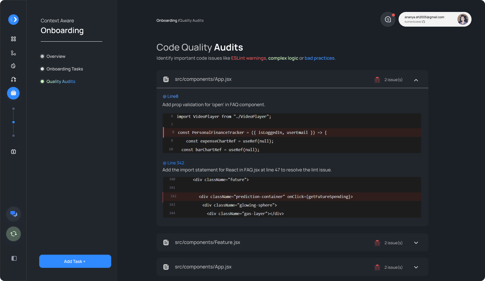
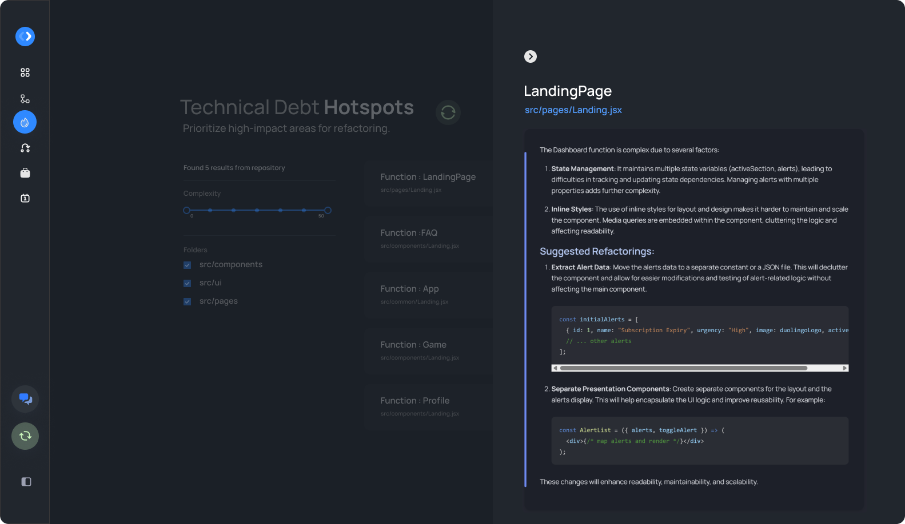
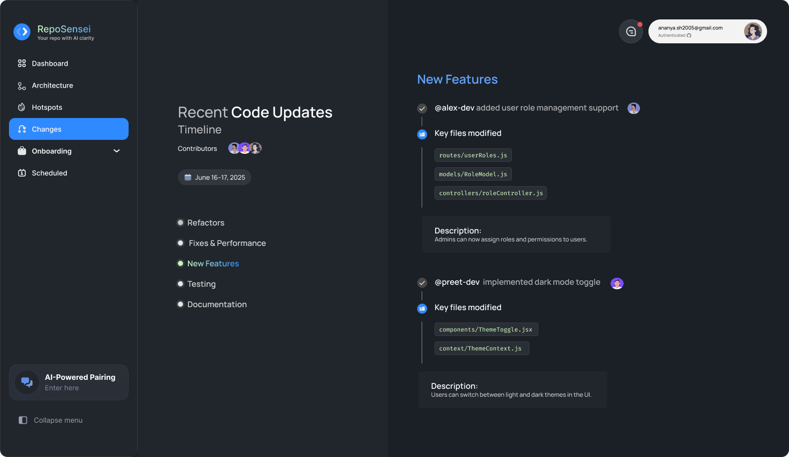
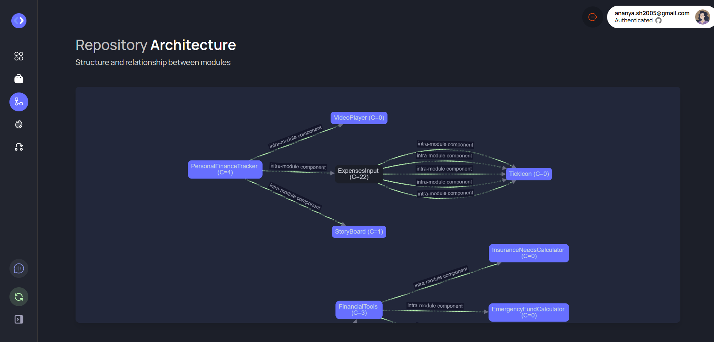
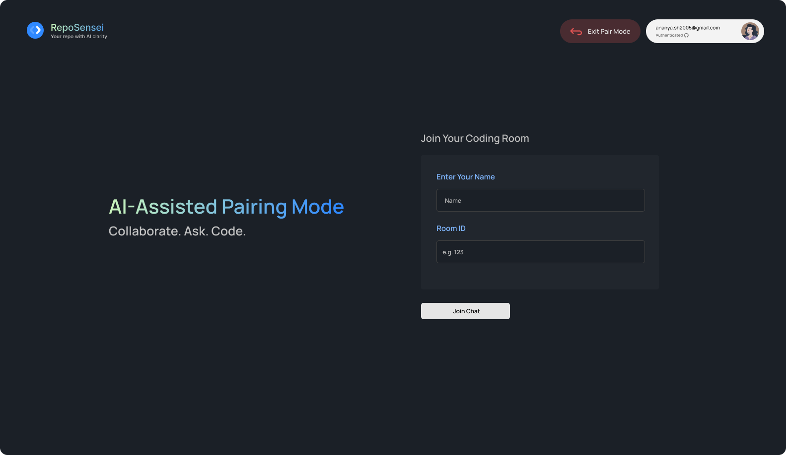
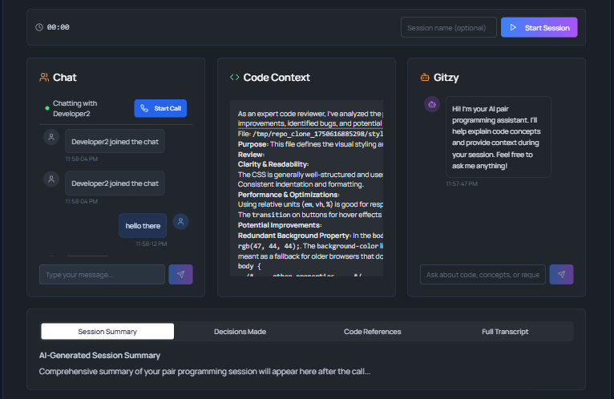

# 📂 RepoSensei — AI-Powered Codebase Intelligence

**RepoSensei** is an AI-powered platform designed to streamline the **understanding**, **maintenance**, and **collaboration** of modern codebases. It accelerates developer onboarding, uncovers hidden technical debt, and empowers teams with real-time insights, role-based walkthroughs, and structured, context-aware task generation — all tailored to how you work.

## 🧩 Key Features

### ✅ Repo Analysis & Navigation
- Interactive **dependency mapping** and architecture visualization
- Detection of technical hotspots and test coverage gaps
- Commit history categorized by type and contributor

### 🧭 Role-Based Onboarding
- Auto-generated repo walkthroughs for frontend/backend developers
- Tailored task lists based on role and codebase context
- One-click onboarding for faster ramp-up

### 🕒 Recent Changes Panel
- Auto-categorizes recent commits into **Features**, **Fixes**, **Refactors**, **Tests**, and **Docs**
- Displays contributor, change description, and impacted files
- Helps assess potential risks and streamline code reviews

### 💡 Repository Architecture Diagram
- Graph-based visualization of module structure, dependencies, and data flow
- Powered by **Cytoscape.js** for real-time interaction
- Ideal for understanding large or unfamiliar codebases

### 🔍 Code Quality Audits
- Automated detection of TODOs, lint violations, and complexity issues
- ESLint-powered file-level insights
- AI-generated tasks with severity and location metadata

### 🔥 Technical Debt Hotspots & Refactor Suggestions
- Identifies and ranks the most debt-prone files
- Highlights stale code, low-test areas, and unresolved TODOs
- Generates AI-powered natural-language refactor suggestions using GPT-4o Mini

### 🤖 AI-Powered Development Tools
- Converts vague goals and code changes into actionable development tasks
- AI chatbot with repo-specific awareness for on-demand help
- GPT-4o & Gemini Flash integration for summarization, pairing, and audits

### 📈 Git Activity Dashboard
- Weekly commit breakdown, code changes by file/module, and language trends
- Auto-generated **Impact Summary Cards** for portfolios and reviews
- Visual breakdown of contributions beyond raw commit counts

### 🎧 AI Pairing Mode
- Real-time **text/audio collaboration** between contributors
- Contextual lookup of relevant files and commit history
- AI assistant answers repo-specific questions on demand

## 📌 Feature Screenshots

### 🖥️ Landing Page

### 📊 User Activity & Impact Statement

### 📂 Onboarding Walkthrough

### ✨ Code Quality Audits

### 🛠️ Debt Hotspots & Refactor Suggestions

### 🕒 Recent Updates Panel

### 💡 Repository Dependencies Diagram

### 💬 AI Pairing Chat

## 🧠 Why RepoSensei?

| Challenge                     | RepoSensei Solution                                        |
|------------------------------|-------------------------------------------------------------|
| Time-consuming onboarding     | Role-aware walkthroughs, tasks, and repo overviews         |
| Hard-to-understand structure | Interactive dependency graph + architecture diagram        |
| Legacy or complex codebases  | Refactor suggestions and debt hotspot analysis             |
| Low contributor visibility    | Personal dashboards + auto-generated impact summaries      |
| Copilot lacks context         | Full-repo understanding with task-aware AI assistants      |

## 🛠️ Tech Stack

### 🔧 Backend
- **Node.js**, **Express.js**
- **Babel Parser** – for static AST analysis
- **simple-git**, **ESLint**, **Socket.IO**

### 🎨 Frontend
- **React.js**, **Tailwind CSS**
- **Cytoscape.js** – for graph visualization

### 📡 Infrastructure & Realtime
- **WebRTC** – real-time audio/text pairing
- **Supabase** – GitHub OAuth + backend auth services
- **MongoDB**, **Docker** – for scalable local deployment

### 🧠 AI Integration
- **GPT-4o** – repo summarization, quality audits, task generation
- **GPT-4o Mini** – refactoring and complexity reduction
- **Gemini Flash** – conversational assistant in Pairing Mode

## 🛡️ Security & Reliability

- **Prompt Sanitization**: Redacts environment variables, secrets, API keys, and internal paths before sending data to any LLM
- **Validation Pipeline**: AI output cross-checked via ESLint and Git history
- **Production Tested**: Validated across 5+ real-world public and private repositories

## 🧪 Future Roadmap

- Offline/self-hosted LLM support for enterprise usage
- Faster AST parsing and parallel static analysis
- VS Code and JetBrains IDE integration
- CI/CD pipeline and PR-level quality gate integration
